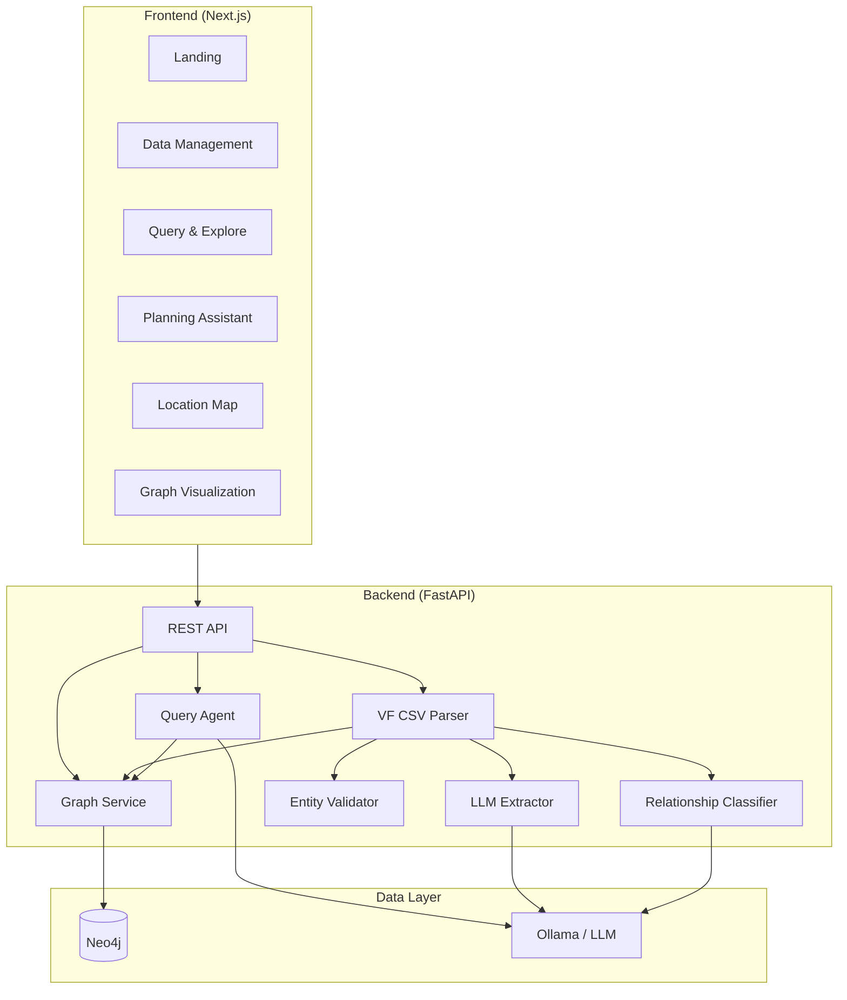
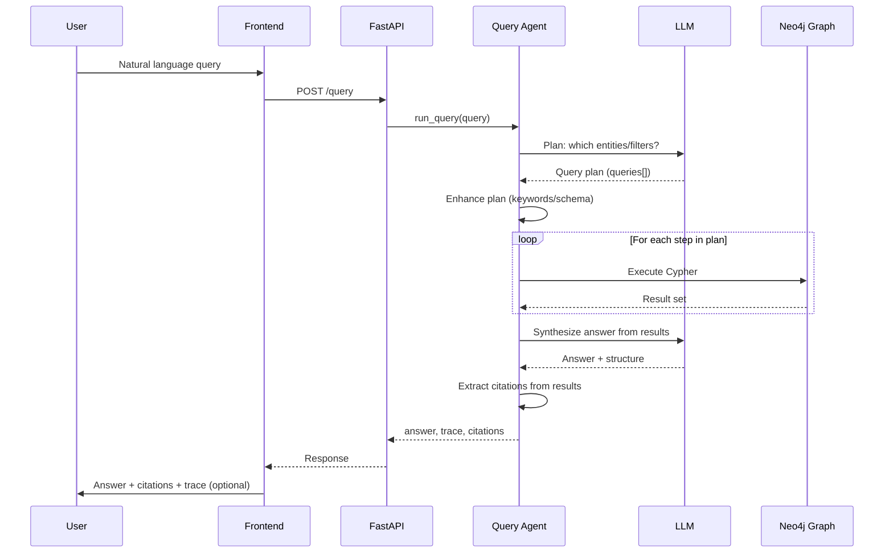
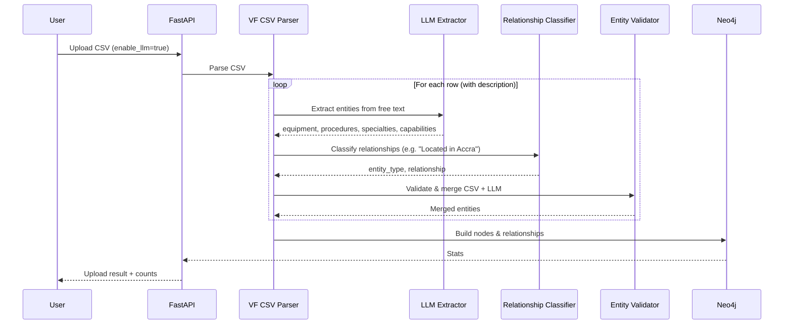

# MediGraph — Intelligent Document Parsing for Bridging Medical Deserts

**Track:** Bridging Medical Deserts — Building Intelligent Document Parsing Agents for the Virtue Foundation  
**Sponsored by:** Databricks

---

## What It Is

**MediGraph** is an agentic AI system that turns messy, unstructured healthcare facility data (e.g. Virtue Foundation Ghana CSV) into a **queryable knowledge graph** and an **intelligence layer** for planners and NGOs. It does not just search: it **extracts**, **verifies**, **reasons**, and **plans** so that “where care exists” and “where it is missing” become actionable.

- **IDP (Intelligent Document Parsing):** Parses facility CSVs, extracts entities from free-form text (procedures, equipment, specialties, capabilities) using LLMs, classifies relationships, and validates/merges with structured columns.
- **Knowledge graph:** Neo4j stores facilities, equipment, procedures, specialties, locations, and capabilities as nodes, with typed relationships (HAS_EQUIPMENT, OFFERS_PROCEDURE, LOCATED_IN, etc.).
- **Agentic query:** A query agent plans multi-step Cypher + keyword enhancement, executes against the graph, and synthesizes natural-language answers with **citations** and **reasoning trace**.
- **Planning & impact:** Planning Assistant tab for resource allocation and gap questions; medical-deserts and equipment-gaps analysis; **map visualization** of query results and locations.

---

## Motivation & Goal

By 2030 the world will face a shortage of over 10 million healthcare workers—often not for lack of expertise but for **lack of coordination**. MediGraph aims to reduce the time to connect patients with the right care by turning facility data into a **coordination engine**: identify infrastructure gaps and medical deserts, detect incomplete or suspicious capability claims, and map where expertise exists—and where lives are at risk for lack of access.

---

## Architecture

### High-Level System

### Simplified Query Flow (Agentic Pipeline)

### Upload & IDP Pipeline

---

## Core Features (MVP vs Track)

| Track requirement | How we deliver |
|-------------------|----------------|
| **Unstructured feature extraction** | LLM Extractor pulls equipment, procedures, specialties, capabilities from free-form description columns; Relationship Classifier infers entity types and relationships from ambiguous text. |
| **Intelligent synthesis** | Query Agent combines structured schema (facilities, locations) with graph data; synthesizes answers from multi-step Cypher results and suggests available data when the query misses. |
| **Planning system** | Dedicated “Planning” tab with natural-language questions (e.g. “Which facilities lack ultrasound and where to prioritize distribution?”); same agent, planning-oriented prompts and example queries. Accessible to non-technical users. |

---

## Stretch & Impact

- **Citations:** Every query response includes **citations** (facility/source names) derived from the result sets used to generate the answer.
- **Agentic-step trace:** Optional **reasoning trace** (plan, queries executed, result summaries) so judges can see which data supported each step.
- **Map visualization:** **Location map** (Mapbox) for query results; geocoded facilities with clustering; medical-deserts and analysis insights surfaced in the UI.
- **Medical deserts & gaps:** Built-in analysis endpoints: `find_medical_deserts` (regions with &lt;3 facilities), `find_equipment_gaps`, `find_inconsistencies` (e.g. procedure without required equipment). Dashboard and Query tab expose these for resource allocation.

---

## How We Made It Better & Scalable (Production Lens)

- **Pluggable LLM:** Single `llm_factory` (Ollama, Gemini, OpenAI, Anthropic) and env-driven config. Swap providers or use a dedicated model for extraction (`OLLAMA_MODEL_EXTRACTOR`) without code changes. Scales from local (Ollama) to cloud APIs.
- **Parallelism:** CSV parsing uses a **thread pool** (`ThreadPoolExecutor`) for chunked rows; configurable `CSV_CHUNK_WORKERS`. Reduces wall-clock time on large uploads.
- **Validation & dedup:** Entity Validator normalizes and merges CSV + LLM output, reduces garbage nodes and duplicate edges. Keeps the graph clean as data volume grows.
- **Stateless API:** FastAPI is stateless; graph and LLM hold the state. Horizontal scaling = run more API replicas behind a load balancer; single Neo4j (or cluster) and shared LLM endpoint.
- **Docker & env:** Full Docker Compose (API, frontend, optional Neo4j); supports **local Neo4j** via `host.docker.internal` and **local Ollama** via `OLLAMA_BASE_URL`. Same image works in dev and production; scale by adding replicas or moving to Kubernetes.
- **Graceful degradation:** Health check reports Neo4j status; clear errors on connection refusal; optional LLM extraction (enable_llm=true/false) so uploads can run fast without LLM when needed.
- **Frontend:** Next.js with SWR for caching; responsive UI; landing → app flow. Ready to plug in auth and stricter CORS for production.

---

## Tech Stack

| Layer | Choice |
|-------|--------|
| **Frontend** | Next.js 16, React 19, Tailwind, shadcn/ui, Framer Motion, Mapbox GL, SWR |
| **Backend** | FastAPI, Python 3.11, LangChain (agent + extraction + classification) |
| **Graph** | Neo4j 5 (Cypher) |
| **LLM** | Ollama (default), or Gemini / OpenAI / Anthropic via env |
| **Deploy** | Docker & Docker Compose; env-based config for local vs containerized Neo4j/Ollama |

---

## Evaluation Alignment

- **Technical accuracy:** Agent handles facility/capability/gap queries; plan + execute + synthesize; anomaly detection via inconsistency and gap analysis.
- **IDP innovation:** Unstructured extraction (LLM Extractor), relationship classification (Classifier), and validation/merge (Validator) on real VF-style CSV and free-text columns.
- **Social impact:** Medical-deserts and equipment-gaps endpoints and UI; planning-oriented queries for allocation and prioritization.
- **User experience:** Natural-language query and planning; citations and optional trace; map and graph viz; single app for data upload, query, and planning.

---

*MediGraph — Turn facility data into a coordination engine so the right expertise reaches the right places faster.*
